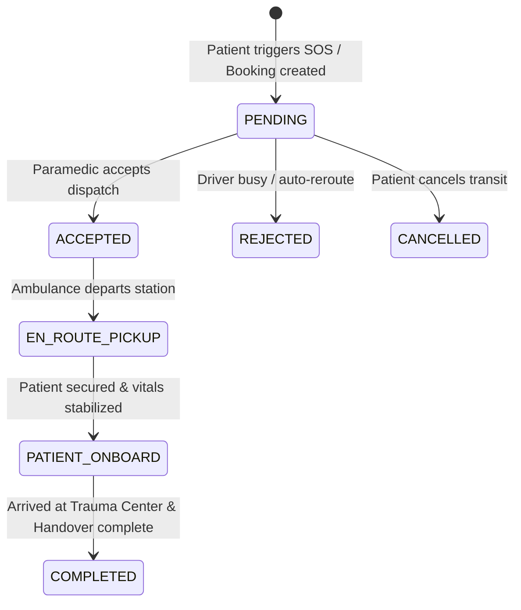

# 🚑 LifeLink & Prescripto - Smart Healthcare & Emergency Ambulance Dispatch Platform

> **"Designed as a scalable, multi-tenant healthcare platform capable of handling real-time emergency dispatch and hospital management across multiple regions."**

[](https://nodejs.org/)
[](https://socket.io/)
[](https://www.mongodb.com/)
[](LICENSE)
[-brightgreen.svg)]()

---

## 📑 Table of Contents
1. [System Highlights](#-system-highlights)
2. [Hierarchical Data Architecture](#-hierarchical-data-architecture)
3. [System Architecture Diagram](#-system-architecture-diagram)
4. [5-Stage Emergency SOS & Ambulance Lifecycle](#-5-stage-emergency-sos--ambulance-lifecycle)
5. [Core Modules & Role Portals](#-core-modules--role-portals)
6. [Comprehensive API Reference](#-comprehensive-api-reference)
7. [Bulk Excel Data Ingestion (.xlsx)](#-bulk-excel-data-ingestion-xlsx)
8. [Performance & Security Engineering](#-performance--security-engineering)
9. [UI Previews & Screenshots](#-ui-previews--screenshots)
10. [Demo Login Credentials](#-demo-login-credentials)
11. [Local Development & Quick Start](#-local-development--quick-start)
12. [Production Deployment Guide](#-production-deployment-guide)

---

## ⚡ System Highlights

- 🌐 **Multi-Tenant Hospital Architecture**: Hierarchical separation of Apex Trauma Centers and Hospital branches, isolating medical staff, beds, and ambulance fleets.
- 🚨 **One-Click Code-Red Emergency Dispatch**: Geolocation-aware nearest paramedic dispatch utilizing the Haversine distance algorithm with sub-second Socket.IO alerts.
- 📡 **Live Bidirectional Telemetry**: Room-based WebSockets streaming vehicle GPS coordinates, bearing, ETA, and vitals between ambulance and trauma bays.
- 📊 **High-Throughput Bulk Data Ingestion**: Multer streaming & SheetJS engine importing hundreds of doctors, drivers, and hospitals from Excel (`.xlsx`) with automated schema validation and duplicate prevention.
- 🔄 **Dual-Store High-Availability Engine**: MongoDB Atlas primary with zero-downtime automated fallback to an in-memory transactional store during network partitions.

---

## 🏛️ Hierarchical Data Architecture

The system enforces strict relational foreign keys and role-based access control (RBAC):

```
                        👑 SuperAdmin (System Owner)
                                     │
                 ┌───────────────────┴───────────────────┐
                 ▼                                       ▼
       🏥 Hospital Admin (Lilavati)            🏥 Hospital Admin (Kokilaben)
           │                   │
   ┌───────┴────────┐    ┌─────┴──────────┐
   ▼                ▼    ▼                ▼
👨‍⚕️ Doctors        🚑 Drivers          👨‍⚕️ Doctors
   │                │
   ▼                ▼
👤 Patient Consultations & Emergency SOS Rides
```

### Strict Relational Integrity:
- **Doctor $\rightarrow$ Hospital**: Linked via `hospitalId` and `hospitalName`.
- **Driver $\rightarrow$ Hospital**: Linked via `hospitalId`, `hospitalName`, and vehicle registration.
- **Appointment**: 3-way atomic relation: `patientId` $\longleftrightarrow$ `doctorId` $\longleftrightarrow$ `hospitalId`.
- **Ambulance Booking**: 3-way atomic relation: `patientId` $\longleftrightarrow$ `driverId` $\longleftrightarrow$ `hospitalId`.

---

## 📐 System Architecture Diagram

```
+-----------------------------------------------------------------------------------+
|                                 CLIENT LAYER                                      |
|  [ Patient Portal ]  [ Doctor Console ]  [ Hospital Admin ]  [ Paramedic Driver ] |
+-----------------------------------------+-----------------------------------------+
                                          |
                      HTTP REST / HTTPS   |   WebSockets (WSS / Socket.io)
                                          ▼
+-----------------------------------------------------------------------------------+
|                             BACKEND GATEWAY LAYER                                 |
|  - CORS & Rate Limiter  - JWT Auth Guard  - Role-Based Access Control (RBAC)      |
+--------------------+------------------------------------+-------------------------+
                     |                                    |
                     ▼                                    ▼
+--------------------------------------+ +------------------------------------------+
|          REST CONTROLLERS            | |          SOCKET.IO ENGINE                |
| - hospitalController.ts              | | - Room-Based Event Dispatcher            |
| - doctorController.ts                | |   * patient_{id}  * driver_{id}          |
| - userController.ts                  | |   * hospital_{id} * ride_{bookingId}     |
| - bookingController.ts               | | - Live GPS Location Broadcaster          |
| - bulkUploadController.ts            | | - Emergency SOS Panic Stream             |
+--------------------+-----------------+ +--------------------+---------------------+
                     |                                        |
                     +-------------------+--------------------+
                                         |
                                         ▼
+-----------------------------------------------------------------------------------+
|                            PERSISTENCE & STORAGE LAYER                            |
|  Primary: MongoDB Atlas (Mongoose ORM)  |  Fallback: In-Memory Transaction Store  |
|  [Hospitals] [Doctors] [Ambulances] [Appointments] [Bookings] [Ratings] [Users]   |
+-----------------------------------------------------------------------------------+
```

---

## 🚑 5-Stage Emergency SOS & Ambulance Lifecycle



1. **`PENDING`**: Dispatch broadcasted to nearest hospital driver room via Socket.IO.
2. **`ACCEPTED`**: Driver claims ride; live GPS tracking room (`ride_{id}`) opens.
3. **`EN_ROUTE_PICKUP`**: Paramedic navigates to pickup coordinates with live ETA updates.
4. **`PATIENT_ONBOARD`**: Patient vitals entered; Hospital ICU Trauma Desk notified for bed preparation.
5. **`COMPLETED`**: Safe handover at hospital emergency bay; feedback & rating unlocked.

---

## 🌟 Core Modules & Role Portals

### 1. 👑 SuperAdmin Portal
- **Hospital Management**: Full CRUD operations for multi-region hospital networks.
- **Global Telemetry**: Real-time aggregation of beds, patient volumes, and fleet readiness.
- **Bulk Import**: Onboard hundreds of hospitals via single Excel sheet (`.xlsx`).
- **Data Purge System**: `/api/admin/clear-all-data` resets test data for live deployments.

### 2. 🏥 Hospital Admin Portal
- **Emergency Intake Radar**: Live inbound ambulance tracker with patient triage condition.
- **ICU Bed Manager**: Dynamic bed allocation counter connected to incoming Code-Red cases.
- **Staff Rostering**: Add, manage, and bulk upload doctors and ambulance drivers.
- **Appointment Queue**: Complete schedule oversight across all clinical departments.

### 3. 👨‍⚕️ Doctor Consultation Portal
- **Earnings & Patient Analytics**: Track revenue ($), completed consultations, and unique patients.
- **Dynamic 7-Day Slot Manager**: Automated slot reservation with conflict detection.
- **Live Prescription Generator**: Issue digital prescriptions synced directly to the patient's device.
- **Availability Toggle**: Instant 1-click status switcher for patient appointments.

### 4. 🚑 Paramedic Driver Portal
- **Emergency Radar**: High-priority alert banner with audio-visual notifications.
- **Accept/Reject Control**: Review patient distance and condition before accepting.
- **Ride Status Updater**: Progress trip through pickup, transit, and hospital arrival.
- **Duty Mode**: Toggle between Available (Online) and Offline.

### 5. 👤 Patient Care Portal
- **Specialist Discovery**: Search doctors across 6 clinical specialties and hospital facilities.
- **Doctor Consultation Booking**: Select convenient date/time slots with instant confirmation.
- **1-Click Emergency SOS**: Instant GPS ping to dispatch nearest ALS/BLS ambulance.
- **Personal Health Console**: Real-time vitals monitoring (Heart Rate, BP, Blood Glucose, Blood Group).

---

## 📡 Comprehensive API Reference

### 🔐 Authentication & Session
| Method | Endpoint | Role / Access | Description |
| :---: | :--- | :--- | :--- |
| `POST` | `/api/auth/register` | Public | Create new patient or provider account |
| `POST` | `/api/auth/login` | Public | Unified 5-role JWT login |
| `GET` | `/api/auth/profile` | Authenticated | Retrieve authenticated user profile |
| `POST` | `/api/auth/logout` | Authenticated | Clear secure session and refresh tokens |

### 👑 SuperAdmin Management
| Method | Endpoint | Role / Access | Description |
| :---: | :--- | :--- | :--- |
| `GET` | `/api/hospitals` | SuperAdmin / Admin | List all registered hospital facilities |
| `POST` | `/api/hospitals` | SuperAdmin | Register new hospital facility |
| `GET` | `/api/hospitals/:id` | SuperAdmin / Admin | Get single hospital details and metrics |
| `PUT` | `/api/hospitals/:id` | SuperAdmin | Update hospital configuration and bed capacity |
| `DELETE` | `/api/hospitals/:id` | SuperAdmin | Deactivate/remove hospital facility |
| `GET` | `/api/superadmin/overview` | SuperAdmin | Global platform analytics & entity counts |
| `POST` | `/api/superadmin/upload/hospitals` | SuperAdmin | **Bulk upload hospitals via Excel (.xlsx)** |

### 🏥 Hospital Admin Operations
| Method | Endpoint | Role / Access | Description |
| :---: | :--- | :--- | :--- |
| `GET` | `/api/hospital/profile` | Hospital Admin | Get current hospital metadata & trauma status |
| `GET` | `/api/hospital/doctors` | Hospital Admin | List doctors assigned to this hospital |
| `POST` | `/api/hospital/doctors` | Hospital Admin | Add a new doctor to this hospital |
| `GET` | `/api/hospital/drivers` | Hospital Admin | List ambulance drivers assigned to this hospital |
| `POST` | `/api/hospital/drivers` | Hospital Admin | Recruit a new paramedic driver to fleet |
| `GET` | `/api/hospital/appointments` | Hospital Admin | View all appointments scheduled at hospital |
| `GET` | `/api/hospital/ambulance-bookings`| Hospital Admin | View all inbound/outbound ambulance trips |
| `GET` | `/api/hospital/dashboard` | Hospital Admin | Hospital live stats (ICU beds, inbound units) |
| `POST` | `/api/hospital/upload/doctors` | Hospital Admin | **Bulk upload doctors via Excel (.xlsx)** |
| `POST` | `/api/hospital/upload/drivers` | Hospital Admin | **Bulk upload drivers via Excel (.xlsx)** |

### 👨‍⚕️ Doctor Operations
| Method | Endpoint | Role / Access | Description |
| :---: | :--- | :--- | :--- |
| `GET` | `/api/doctor/list` | Public | List all doctors (supports `?hospitalId=...`) |
| `GET` | `/api/doctor/appointments` | Doctor | Get doctor consultation queue |
| `POST` | `/api/doctor/complete-appointment`| Doctor | Mark appointment complete and credit earnings |
| `POST` | `/api/doctor/cancel-appointment` | Doctor | Cancel appointment and free calendar slot |
| `GET` | `/api/doctor/dashboard` | Doctor | Doctor practice revenue & patient stats |

### 🚑 Ambulance & Emergency SOS
| Method | Endpoint | Role / Access | Description |
| :---: | :--- | :--- | :--- |
| `POST` | `/api/bookings/create` | Patient | Create standard ambulance booking |
| `POST` | `/api/bookings/emergency-sos` | Patient / Emergency | **1-Click Code-Red Emergency Dispatch** |
| `POST` | `/api/bookings/accept` | Driver | Driver accepts ambulance booking |
| `POST` | `/api/bookings/reject` | Driver | Driver rejects booking with reason |
| `POST` | `/api/bookings/status` | Driver | Update ride status (`EN_ROUTE`, `ONBOARD`, etc.) |
| `GET` | `/api/bookings/driver-trips` | Driver | Get driver trip history and queue |
| `GET` | `/api/bookings/my-bookings` | Patient | Get patient ride history |
| `GET` | `/api/bookings/:bookingId` | Authenticated | Get real-time status of specific booking |

---

## 📊 Bulk Excel Data Ingestion (.xlsx)

The platform supports high-speed bulk ingestion using memory buffers and SheetJS.

```
+------------------+      +-------------------+      +--------------------+      +--------------------+
|  Excel File (.xlsx) | ---> |  Multer (Memory)  | ---> |  SheetJS Validator | ---> |  MongoDB / Store   |
+------------------+      +-------------------+      +--------------------+      +--------------------+
                                                               |
                                                               v (Validation Errors)
                                                     +--------------------+
                                                     | JSON Error Summary |
                                                     +--------------------+
```

### Required Column Formats:

#### 1. Doctors Sheet (`sample_doctors.xlsx`)
| Column | Required | Description | Example |
| :--- | :---: | :--- | :--- |
| `name` | Yes | Doctor's full name | `Dr. Arjun Kapoor` |
| `email` | Yes | Unique email address | `arjun.kapoor@prescripto.com` |
| `specialization` | Yes | Clinical Specialty | `Cardiologist` |
| `phone` | Yes | Contact Phone | `+91 98201 11223` |
| `degree` | No | Medical Degree | `MBBS, MD (Cardiology)` |
| `experience` | No | Years of experience | `7 Years` |
| `fees` | No | Consultation fee ($) | `70` |

#### 2. Drivers Sheet (`sample_drivers.xlsx`)
| Column | Required | Description | Example |
| :--- | :---: | :--- | :--- |
| `name` | Yes | Driver's full name | `Vikas Deshmukh` |
| `email` | Yes | Unique email address | `driver.vikas@prescripto.com` |
| `phone` | Yes | Contact Phone | `+91 98111 22334` |
| `vehicleNumber`| Yes | Registration Number | `MH-01-EQ-5566` |
| `ambulanceType`| No | BASIC / ADVANCED / ICU | `ADVANCED` |

#### 3. Hospitals Sheet (`sample_hospitals.xlsx`)
| Column | Required | Description | Example |
| :--- | :---: | :--- | :--- |
| `name` | Yes | Hospital facility name | `Nanavati Max Hospital` |
| `address` | Yes | Physical address | `SV Road, Vile Parle West` |
| `email` | Yes | Administrator email | `nanavati.admin@prescripto.com` |
| `phone` | Yes | Trauma Desk Phone | `+91 22 2626 7500` |
| `city` | No | City of operation | `Mumbai` |
| `totalBeds` | No | Total bed capacity | `350` |
| `icuBedsAvailable`| No | Resuscitation ICU beds | `25` |

> Templates located in [`backend/samples/`](file:///c:/Users/Ashut/Desktop/Shreyash/backend/samples/): `sample_doctors.xlsx`, `sample_drivers.xlsx`, `sample_hospitals.xlsx`.

---

## 🛡️ Performance & Security Engineering

- **JWT Authentication & Rotation**: Stateless JWT access tokens paired with secure token refreshing.
- **bcrypt Password Hashing**: Cryptographic salt rounds (10) for doctor, patient, and admin passwords.
- **Input Sanitization & Schema Validation**: Strict regex email validators and required field checks on all routes.
- **Socket.IO Room Isolation**: Granular room-based event broadcasting (`patient_{id}`, `driver_{id}`, `hospital_{id}`, `ride_{id}`) preventing cross-tenant data leaks.
- **Duplicate Prevention**: Multi-level deduplication scanning both in-file rows and database collections before write.
- **Zero-Downtime Dual Storage**: Seamless failover to transactional in-memory store if MongoDB Atlas experiences network timeouts.

---

## 🖼️ UI Previews & Screenshots

| Portal | Preview | Key Features |
| :--- | :--- | :--- |
| **Unified Login** | `[ 5-Role Direct Auth Screen ]` | 1-Click quick login for Patient, Doctor, Hospital, Driver, Admin |
| **Patient Console** | `[ Patient Health & SOS Console ]` | Live patient vitals, active appointments, 1-click Emergency SOS |
| **Paramedic Radar** | `[ Live GPS Ambulance Radar ]` | Accept/reject dispatch cards, trip status lifecycle, duty toggle |
| **Hospital Desk** | `[ Apex Trauma Command Center ]` | ICU bed counters, inbound patient telemetry, staff management |
| **Doctor Portal** | `[ Physician Practice Dashboard ]` | Earnings charts, 7-day slot availability, digital prescription tool |

---

## 👥 Demo Login Credentials

| Role | Email | Password | Access Capabilities |
| :--- | :--- | :--- | :--- |
| 👑 **Super Admin** | `admin@prescripto.com` | `admin123` | Platform oversight, Hospital CRUD, Global analytics, Bulk hospital import |
| 🏥 **Hospital Admin**| `hospital@prescripto.com` | `hospital123` | Lilavati Hospital desk, Doctor & Driver management, Bulk uploads, ICU beds |
| 👨‍⚕️ **Doctor** | `doc1@prescripto.com` | `doc123` | Dr. Richard James - Consultation queue, Prescription tool, Availability |
| 🚑 **Ambulance Driver**| `driver1@prescripto.com` | `driver123` | Paramedic Rajesh Kumar - Emergency SOS intake, Accept/Reject, Ride status |
| 👤 **Patient** | `patient@prescripto.com` | `password123` | Edward Vincent - Book doctors, Emergency SOS dispatch, Health vitals |

---

## 🚀 Local Development & Quick Start

### 1. Clone & Install
```powershell
git clone https://github.com/shreyashkarde/life-link-.git
cd life-link-
npm run install:all
```

### 2. Configure Environment (`backend/.env`)
```env
PORT=5000
MONGODB_URI=mongodb+srv://<username>:<password>@cluster.mongodb.net/lifelink_db?retryWrites=true&w=majority
JWT_SECRET=your_super_secret_jwt_key
ADMIN_EMAIL=admin@prescripto.com
ADMIN_PASSWORD=admin123
```

### 3. Launch Development Servers
```powershell
# Start both Backend (Port 5000) and Frontend (Port 5173):
npm run dev
```

- **Frontend Application**: [`http://localhost:5173`](http://localhost:5173)
- **Backend API Server**: [`http://localhost:5000`](http://localhost:5000)
- **API Health Check**: [`http://localhost:5000/api/health`](http://localhost:5000/api/health)

---

## 🌐 Production Deployment Guide

### Deployment Overview:
```
+-------------------------------------------------------------+
| Frontend (React + Vite)  --> Vercel / Netlify / AWS S3      |
| Backend (Node.js + Express) --> Render / Railway / AWS EC2  |
| Database (MongoDB Atlas) --> Dedicated Cloud Replica Set    |
+-------------------------------------------------------------+
```

### Environment Variables Matrix:

| Variable | Frontend (.env) | Backend (.env) | Description |
| :--- | :---: | :---: | :--- |
| `VITE_BACKEND_URL` | `https://api.lifelink.health` | — | Backend REST/Socket API URL |
| `PORT` | — | `5000` | Server listening port |
| `MONGODB_URI` | — | `mongodb+srv://...` | MongoDB Atlas connection string |
| `JWT_SECRET` | — | `secret_key` | Token signing secret |
| `ADMIN_EMAIL` | — | `admin@prescripto.com` | Master superadmin identity |
| `ADMIN_PASSWORD` | — | `admin123` | Master superadmin credential |

---

## 📄 License & Attribution
Distributed under the **MIT License**. Built for high-reliability Smart Healthcare & Emergency Dispatch Operations.
